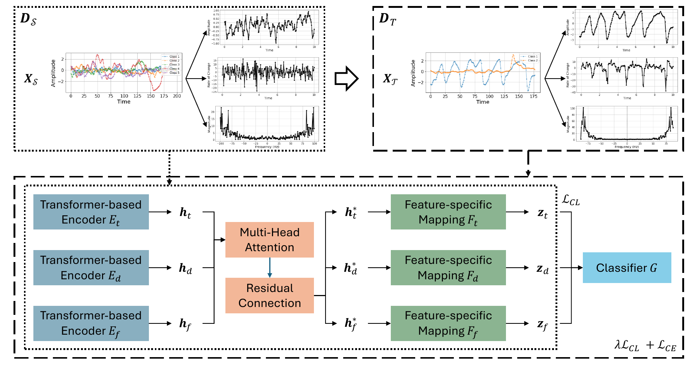

# Multi-View Contrastive Learning for Robust Domain Adaptation in Medical Time Series Analysis

**CHIL 2025 Models & Methods Track - Best Paper Award**

[Paper](https://proceedings.mlr.press/v287/oh25a.html) |
[arXiv](https://arxiv.org/abs/2506.22393) |
[Poster](https://drive.google.com/file/d/1jROcBGxbZ7dpzwBkzSl3VaoHUnL0LqhJ/view) |
[Overview PDF](assets/figures/overview.pdf)



## Abstract

Adapting machine learning models to medical time series across domains is challenging because temporal dependencies and dynamic distribution shifts can degrade transfer performance. This paper introduces a multi-view contrastive learning framework that integrates temporal patterns, derivative-based dynamics, and frequency-domain features. The method uses independent encoders with hierarchical fusion to learn transferable representations that preserve temporal coherence across domains. Experiments evaluate the framework on diverse medical time-series modalities, including EEG, ECG, and EMG.

## Overview

This repository contains the official implementation of **Multi-View Contrastive Learning for Robust Domain Adaptation in Medical Time Series Analysis**. The framework adapts medical time-series models across source and target domains by learning complementary temporal, derivative, and frequency-domain representations.

The model uses view-specific Transformer encoders, multi-head attention for hierarchical feature interaction, and contrastive pre-training on a source domain before target-domain fine-tuning. Experiments cover diverse medical time-series modalities, including EEG, ECG, and EMG.

## Repository Structure

- `data_preprocess.py`: preprocesses time-series datasets into the expected serialized format.
- `run_pretrain.py`: pre-trains the multi-view encoder with the contrastive objective.
- `run_finetune.py`: fine-tunes and evaluates the pre-trained encoder on target-domain tasks.
- `src/`: model, data loading, training, evaluation, configuration, and utility modules.

## Citation

If you find this repository useful, please cite the official PMLR version. Paper: [PMLR v287 (CHIL 2025), pp. 502-526](https://proceedings.mlr.press/v287/oh25a.html) · arXiv: [arXiv:2506.22393](https://arxiv.org/abs/2506.22393)

```bibtex
@inproceedings{oh_multi-view_2025,
	author       = {Oh, YongKyung and Bui, Alex},
	title        = {Multi-{View} {Contrastive} {Learning} for {Robust} {Domain} {Adaptation} in {Medical} {Time} {Series} {Analysis}},
	booktitle    = {Proceedings of the sixth {Conference} on {Health}, {Inference}, and {Learning}},
	volume       = 287,
	pages        = {502--526},
	publisher    = {PMLR},
	address      = {Proceedings of Machine Learning Research},
	year         = 2025,
	editor       = {Xu, Xuhai Orson and Choi, Edward and Singhal, Pankhuri and Gerych, Walter and Tang, Shengpu and Agrawal, Monica and Subbaswamy, Adarsh and Sizikova, Elena and Dunn, Jessilyn and Daneshjou, Roxana and Sarker, Tasmie and McDermott, Matthew and Chen, Irene}
}
```

```bibtex
@misc{oh_multi-view_2025_arxiv,
	author       = {Oh, YongKyung and Bui, Alex},
	title        = {Multi-{View} {Contrastive} {Learning} for {Robust} {Domain} {Adaptation} in {Medical} {Time} {Series} {Analysis}},
	publisher    = {arXiv},
	year         = 2025,
	doi          = {10.48550/arXiv.2506.22393},
	url          = {https://arxiv.org/abs/2506.22393}
}
```
